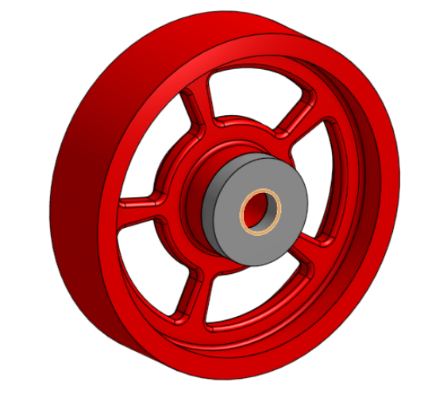

# BasicCAD

We are creating a caster.

---
## Table of Contents
* [Table of Contents](#Table-of-Contents)
* [Base](#Base)
* [Mount](#Mount)
* [Fork](#Fork)
* [Tire](#Tire)
* [Wheel](#Wheel)
* [AxleCollarBearings](#AxleCollarBearings)

## Base

### Description

The first assignment is to create the caster base.  The base's dimensions are 200 mm x 120 mm and 8 mm thick.  It has 6 holes 10 mm wide and 20 mm from the edge equally spaced along the edges.

### Evidence (https://cvilleschools.onshape.com/documents/0d70f655203ca304cb3c5b7d/w/f55603f962f6fc74f5548a68/e/41d730c570a8d75fce9f51b6)

### Image

Screenshot 2020-10-01 at 3.55.23 PM

### Reflection

This part was real easy and I did not have any hic ups.

---

## Mount

### Description
The mount is like the base but it is a little smaller.
### Evidence
https://cvilleschools.onshape.com/documents/a84fd343993e3f63bb6b1e95/w/8490bb00a844ad0d15743d9d/e/f2a0a505cc65fc4e7efa2d8a
### Image
Screenshot 2020-10-08 at 3.42.28 PM
### Reflection
The mount was straight forward and not very hard.
---

## Fork

### Description
The fork is a part with two 75 mm prongs and a tubular base.
### Evidence
https://cvilleschools.onshape.com/documents/a84fd343993e3f63bb6b1e95/w/8490bb00a844ad0d15743d9d/e/f4ac0f6ad6e4098788014a3a
### Image
Screenshot 2020-10-08 at 3.45.48 PM
### Reflection
Onshape makes this super easy.
---

## Tire

### Description

The tire is a revolved part of the caster.

### Evidence

[Link to Onshape] https://cvilleschools.onshape.com/documents/a84fd343993e3f63bb6b1e95/w/8490bb00a844ad0d15743d9d/e/f864c239099b64681cf237bb

### Image

### Reflection

The sketching part was confusing but after that is was strate forward. The video helped me alot.

---

## Wheel

### Description

The wheel is the part the holds the tire.

### Evidence

[link to onshape](https://cvilleschools.onshape.com/documents/a84fd343993e3f63bb6b1e95/w/8490bb00a844ad0d15743d9d/e/a7b28716f116cdbc0eef940d)

### Image

### Reflection

The wheel was one of the harder parts but onshape made it pretty easy.

---

## AxleCollarBearings

### Description

The axel, collar, and bearings are the parts that allow the wheel to attach to the fork and spin.

### Evidence

https://cvilleschools.onshape.com/documents?resourceType=filter&nodeId=1

### Image

### Reflection

The axle, coller, and bearings were pretty easy. If I was to do this again I would do all the parts in the same studio.

---
